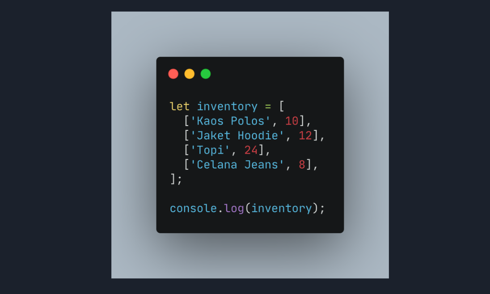
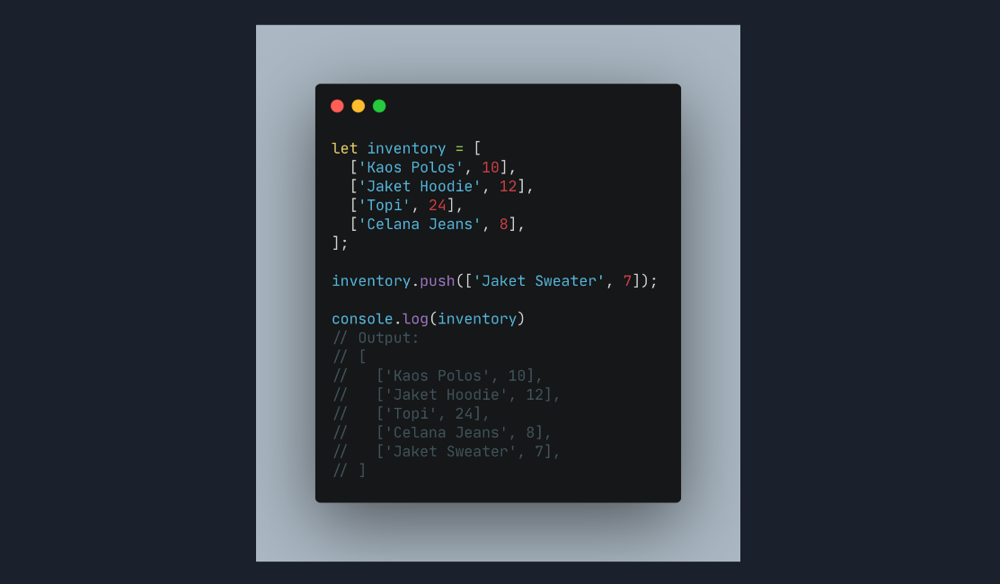
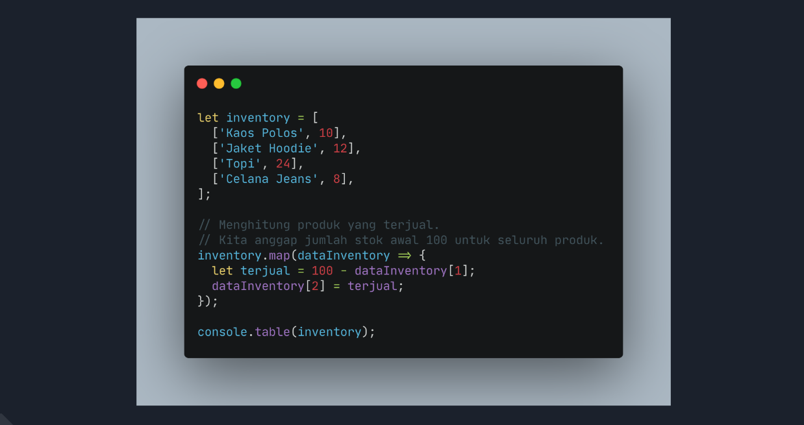
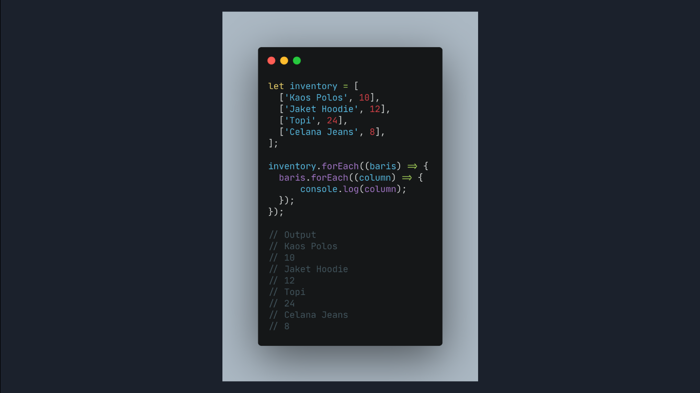

# **RANGKUMAN MATERI MINGGU KE-3**

## **1. ARAY**

Apa itu Array?
suatu tipe data yang dapat menampung berbagai tipe dataa

### **- membuat array**
aray di definisikan menggunakan square brackets [ ]

 Array pada javascript dihitung dari index data ke-0.
Data pertama adalah index ke-0.

### **Update Array**
 kita dapat mengupdate data pada Array

 

 ### **Properti Array**
  **.length**

  length akan mengembalikan nilai dari jumlah panjang data suatu array.

  

  ### **Array Method**
  adalah fungsi yang melekat pada array

  - .push() 

.push() adalah method untuk menambahkan item  array pada urutan yang paling akhir.
 

 - .Pop()

 .pop() adalah method yang menghapus item array index terakhir.

- .shift()

.shift() adalah method untuk menghapus item Array pada index pertama

- .unshift()

.unshift() adalah method untuk menambahkan item Array pada index pertama

- .sort()

.sort() adalah method untuk mengurutkan secara Ascending atau Descending Alphanumeric
 

 ## **Looping Array**

 Array memiliki built in methods untuk melakukan looping yaitu **.map() dan .forEach()**

 ### **.For each()**

 .forEach() adalah method untuk melakukan looping pada setiap elemen array.

### **.map()**

.map() melakukan perulangan/looping dengan membuat array baru.

### **Perbandingan .for each vs .map**

Perbedaannya adalah .forEach tidak dapat membuat Array baru dari hasil operasi yang ada dalam looping

Lalu dari segi performance juga sangat jauh.

### **kapan harus menggunakan for each dan map**
-  Jadi, gunakan **.forEach()** jika hanya memerlukan looping untuk menampilkan saja atau menyimpan ke database.

- Gunakan **.map()** jika akan melakukan operasi pada array seperti yang dapat mengubah nilai array sebelumnya.

## **Multidimensional Array**

Multidimensional Array bisa dianalogikan dengan array of array.
Ada array didalam array.

### **menggunakan Property dan Method built-in Array.**

- **.push()**

 - **.map()**
 
  
  ### **LOOPING FOR MULTIDIMENSIONAL ARRAY**
  

# **JavaScript Object**

Jadi pada programming, object adalah sebuah tipe data pada variabel yang menyimpan properti dan fungsi (method)

 
 - Sama seperti array, didalam object kita dapat menyimpan properti dengan tipe data apapun.

kita juga memanggil menggunakan bracket notation
> console.log(people['name']);

### **Update Object**
 - Object dapat mengupdate value dari key yang sudah tersedia
- Object dapat menambahkan key dan value baru

### **Delete Object Property**
Kita dapat menghapus properti dari object menggunakan delete operator.

## **Nested Object**
Object yang berasal dari turunan object lainnya.

## **Pass by reference**
Kita bisa mengubah data yang ada pada object melalui sebuah function dan memasukkan object sebagai parameter function.

## **Looping Object**
Jika kita ingin menampilkan seluruh object properti. Kita bisa menggunakan looping.

Jadi tidak perlu mengakses secara manual memanggil setiap propertinya.

## **REKURSIF**
Recursive adalah function yang memanggil dirinya sendiri sampai kondisi tertentu.

**Contoh Kasus**

- CountDown
.png)

- Bilangan pangkat (x=bilangan),(n=pangkatnya)
.png)

# **JAVASCRIPT REGEX**

Regex adalah susunan karakter/deretan karakter spesial yang menggambarkan pattern/pola untuk pencarian text pada sebuah string atau document.

Regex = Text matching.

### **Literals**
Literals adalah konsep regex yang paling sederhana dimana kita membuat regex sesuai dengan text yang ingin kita cari/match atau mengandung text yang kita cari.

regex digunakan dalam:
- Validasi input dari sebuah FORM
- Mencari keyword tertentu pada - email atau halaman web
- Mencari IP address dalam kisaran tertentu

# **OOP(Object Oriented Programming)**

Object Oriented Programming (OOP) adalah suatu paradigma dalam pemrograman.

Kita telah mempelajari paradigma seperti procedural, conditional, hingga function.
## **4 Pilar dalam OOP**

- Encapsulation
- Abstraction
- Inheritance
- Polymorpishm

**Encapsulation** 

Encapsulation adalah cara untuk membatasi akses langsung ke properti atau method dari sebuah objek.

.png)

**Inheritance**

Inheritance dalam OOP adalah sebuah proses dimana sebuah class mewariskan property dan methodnya ke class lain atau childnya.

.png)

**Polymorpishm**

Nah pada Polymorpishm, method yang diwariskan bisa kita ubah dengan behaviour yang berbeda menyesuaikan child class yang kita buat.
.png)

**Abstraction**

Abstraction adalah sebuah teknik untuk menyembunyikan detail tertentu dari sebuah objek/method dan hanya menampilkan fungsionalitas atau fitur penting dari objek tersebut.

Terkadang method yang tidak memiliki body pada parent class.

.png)

# **Modulus**
  
adalah proses export import suatu program

cara menggunakan Modulus 
dengan menambahkan type di sript
` <script type="module" src="file.js">`

- cara eksport
.png)
- cara ekport menggunkan "as"
.png)
- cara impornya
.png)

# **Web storage**

 salah satu Web API yang dapat menyimpan data secara lokal pada sisi client.

 **jenis-jenis Web Storage**
 - local storage
- sessions storage
 
 **Perbedaan local dan sessions storage**

 kalau local bersifat permanen walaupun kita keluar dari website

 sedangkan sessions hanya sementara 

 **membuat web storage**
 >let key = 'Item 1';
localStorage.setItem(key, 'Value');

**untuk  get item**
>let myItem = localStorage.getItem(key);

**untuk update**
>localStorage.setItem(key, 'New Value');

**untuk menghapus key**
>localStorage.removeItem(key); 